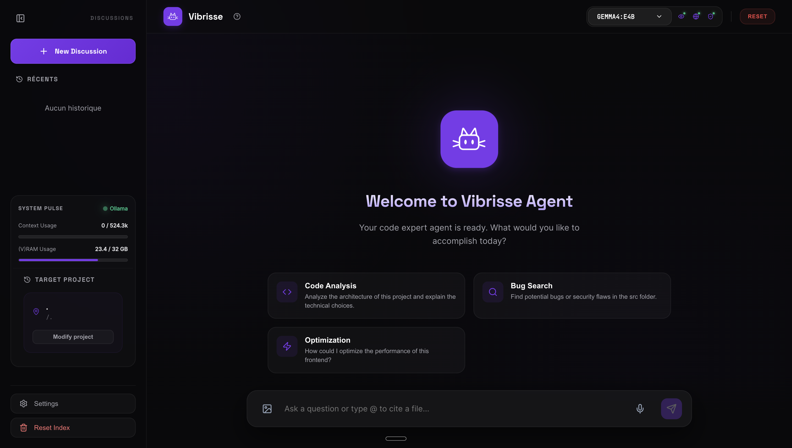

# 🐱 Vibrisse Agent : L'assistant IA qui comprend ton code 🚀

[](file:///README.md)
[](#)
[](file:///AGENTS.md)
[](https://ollama.com)

> **"vi·brisse" (nom fém.) :** Poils longs et raides poussant sur le museau de nombreux mammifères, utilisés comme organes du toucher. Moustaches.

Bâti sur la conviction que **"Petits modèles + Grands outils = Performance professionnelle"**, Vibrisse transforme tes bases de code locales en partenaires de conversation intelligents. Il ressent les patterns et navigue dans les architectures complexes avec une précision chirurgicale.

<p align="center">
  
</p>

---

## ✨ Points Forts
- **RAG Triple-Couche** : Recherche sémantique, BM25 et **Surgical Grep** (ripgrep) pour une précision technique totale.
- **Architecture Supervisor/Worker** : Des experts spécialisés (Coder, Architecte, Writer) pour un raisonnement profond.
- **Interface Studio** : Une UI web "Obsidian Glass" immersive avec monitoring du contexte en temps réel.
- **100% Local & Souverain** : Intelligence locale via Ollama. Aucune donnée ne quitte ta machine.

---

## 🏁 Démarrage Rapide

1. **Pré-requis** : [Ollama](https://ollama.com/), Python 3.11+, Node.js 18+.
2. **Lancement** :
```bash
git clone https://github.com/QuentinMerle/vibrisse-agent.git
cd vibrisse-agent

# Lancement en une commande (Install & Start)
./vibrisse-cli.sh
```

---

## 📚 Documentation

La documentation détaillée est disponible dans le dossier `docs/` (en anglais) :

- **[Capacités & Outils](docs/features/capabilities.md)** : Ce que l'agent peut réellement faire.
- **[Sécurité & Confidentialité](docs/features/security.md)** : Comment nous protégeons ton code.
- **[Architecture Technique](AGENTS.md)** : Plongée dans le graphe et la logique multi-agents.
- **[Roadmap d'Évolution](ROADMAP.md)** : Notre vision pour la suite.

---

## ⌨️ Raccourcis Productivité
| Touche | Action |
| :--- | :--- |
| `CMD + K` | Focus sur la barre de saisie |
| `CMD + B` | Réduire / Agrandir la sidebar |
| `CMD + N` | Nouvelle discussion propre |

---
*Vibrisse AI: Small models, Great tools.*
