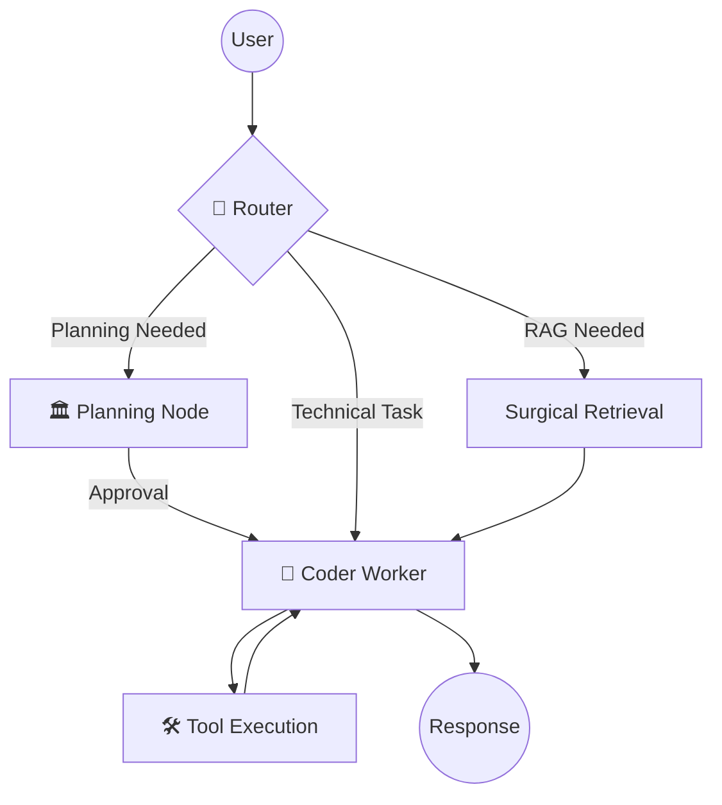
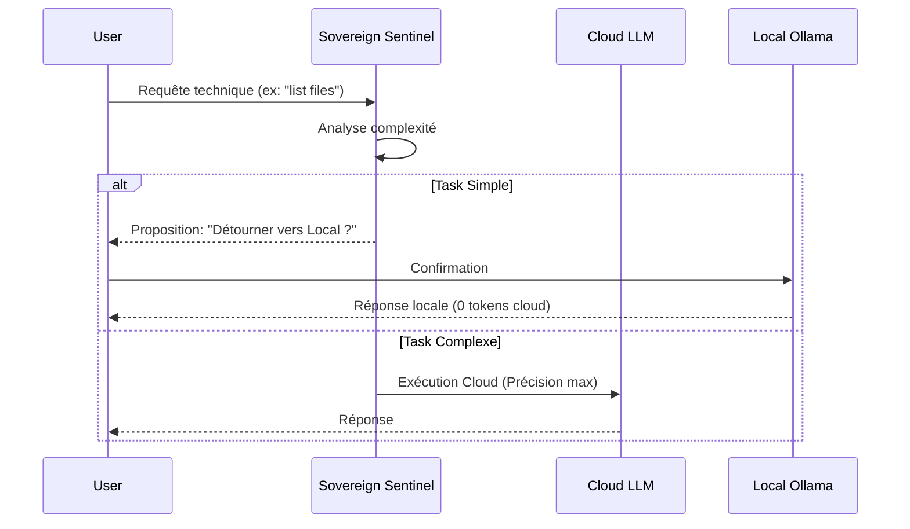

# Architecture Détillée - Vibrisse Agent

## 🏗️ Structure Backend (`app/`)
Le backend suit une structure Domain-Driven Design (DDD) légère :
- `app/agents/`: Logique agentique.
    - `graph.py`: Définition du graphe d'états LangGraph.
    - `nodes/`: Nœuds isolés (`vision`, `retrieval`, `generation`, `tool_execution`).
- `app/services/`: Couche logique métier.
    - `llm/`: Factory et services liés aux modèles.
    - `rag/`: Gestion de l'indexation et du stockage vectoriel.
    - `mcp/`: Client pour la connexion aux serveurs d'outils externes.
    - `core/`: Services transversaux (SSE, onboarding, watchers, evaluation, sovereign_routing).
- `app/api/`: Points d'entrée FastAPI.

## 🌊 Flux Global (LangGraph)

## ⚖️ Sovereign Routing (Smart Offloading)

## 🎨 Frontend (`frontend/`)
- **Tech Stack** : React + Vite + Vanilla CSS.
- **Esthétique** : "Obsidian Glass" (transparences, flous, contrastes élevés).
- **Composants Clés** :
    - `VibrisseAvatar` : Réagit aux états de réflexion.
    - `ThinkingConsole` : Affiche le flux de pensée de l'agent.
