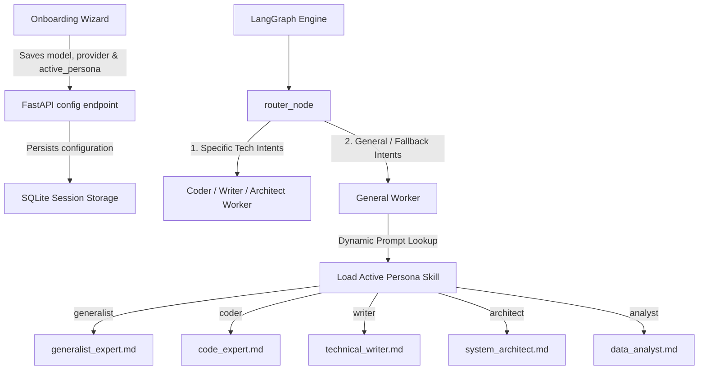

# 🧠 Vibrisse Agent - Dynamic Persona & Prompt Alignment System

> [!NOTE]
> Under local LLM hardware constraints, running multiple models concurrently causes high VRAM swapping latency (20s - 45s). To maintain sub-second response times, Vibrisse implements a **single-model active profile** strategy coupled with **dynamic prompt engineering fallback**, matching the chosen Wizard Persona with specialized system prompts.

---

## 🏗️ Architectural Overview

### 1. Wizard-to-Backend Sync
When the user finishes the onboarding wizard, they select a Persona (e.g. Coder, Writer, Generalist).
- **Previous behavior**: The frontend only persisted the model name, completely losing the semantic category (Persona) of the selection.
- **Verdict implementation**: The wizard now calls `/api/system/config/model` transmitting both the chosen model and the semantic category (`active_persona: selectedPersona`). The backend saves this inside `LLM_ACTIVE_PERSONA` and persists it globally to the SQLite session database.

### 2. Dynamic Fallback Prompt Lookup
Inside `app/agents/nodes/generation.py`, instead of loading a static `code_expert.md` system prompt for general tasks, we perform a dynamic lookup against `settings.LLM_ACTIVE_PERSONA` to serve a tailored fallback prompt aligned with the model's core strength:

| Wizard Persona | Default Model | System Prompt File | Persona Guidelines & Tone |
| :--- | :--- | :--- | :--- |
| 🧭 **Généraliste** | `llama3.1` or `phi3` | `generalist_expert.md` | Polyvalent, synthetic, balanced writing. |
| 💻 **Expert Coder** | `qwen2.5-coder` | `code_expert.md` | Dev-oriented, deep refactoring, code quality. |
| 📚 **Tech Writer** | `mistral-nemo` | `technical_writer.md` | Structure, high readability, documentation focus. |
| 🏗️ **System Architect** | `command-r` | `system_architect.md` | System design, components relationships, scaling. |
| 📊 **Data Scientist** | `gemma2` | `data_analyst.md` | Mathematical rigor, SQL, data structures, tables. |

---

## 🛠️ Implemented Components

### Backend Enhancements
- **`app/core/config.py`**: Added `LLM_ACTIVE_PERSONA` with session recovery to guarantee persistence across app restarts.
- **`app/api/endpoints/system.py`**: Upgraded `/config/model` POST payload and `/config` GET response to handle and restore the active persona.
- **`app/agents/nodes/generation.py`**: Dynamically resolves `skill_name` based on the persistent active persona configuration.
- **`app/agents/skills/generalist_expert.md`**: A brand new polyvalent general assistant prompt.
- **`app/agents/skills/data_analyst.md`**: A specialized data scientist/logical reasoning prompt.

### Frontend Enhancements
- **`frontend/src/components/onboarding/OnboardingWizard.jsx`**: Connects `api.updateGlobalModel` during completion to register the persona dynamically.
- **`frontend/src/hooks/useConfig.js`**: Upgrades manual model swaps to sync back settings securely.
- **`frontend/src/components/ChatInput.jsx` & `frontend/src/components/ChatInput.css`**: Stripped out the manual persona pill selectors to keep the Obsidian Glass UI minimal and free of clutter.
